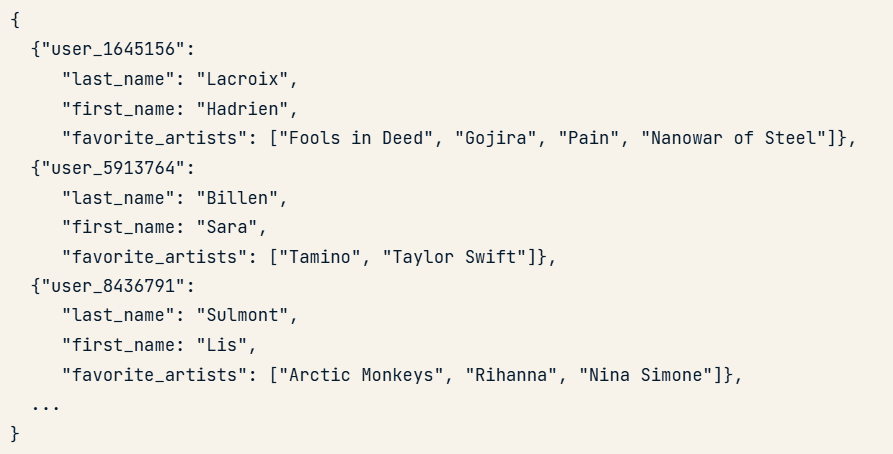
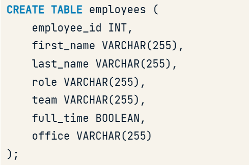
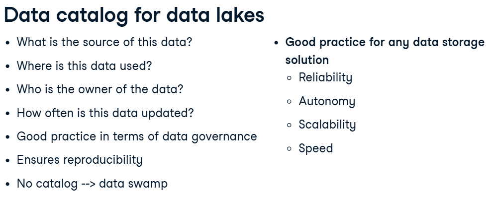
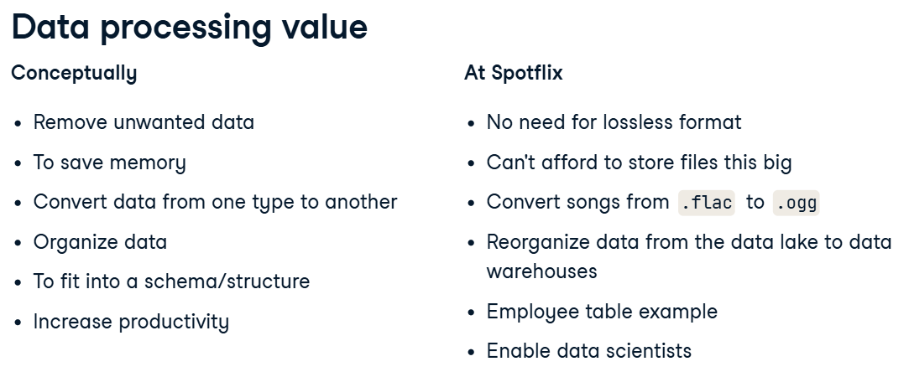
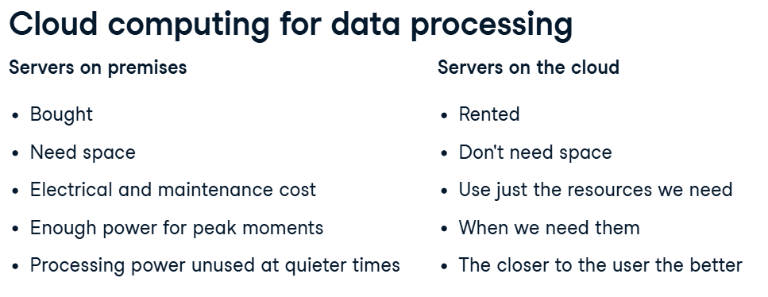

The concept of data pipelines, crucial for managing and processing data efficiently in organizations like "Spotflix". Data pipelines automate the flow of data from its source to storage, reducing errors and saving time. Here are the key points:

- **Data as the New Oil**: Just as oil undergoes various processes from extraction to reaching the end consumer, data is processed and moved through pipelines from collection to utilization.
- **Spotflix Example**: You explored how Spotflix uses data pipelines to handle data from different sources, such as user actions and internal systems, and processes it for various needs like recommendations.
- **ETL Process**: The term ETL, standing for Extract, Transform, Load, was introduced as a popular framework for designing data pipelines. It highlights the sequential steps of extracting data from sources, transforming it to fit operational needs, and loading it into a destination for storage and analysis.
	# Example of an ETL process
	 extract_data()
	 transform_data() 
	 load_data()

-  **Exercise on Building a Pipeline**: You practiced ordering steps to build a pipeline for generating a "Weekly Playlist" for a user, emphasizing the importance of understanding the user's preferences and finding similar tastes.

This lesson underscored the significance of data pipelines in efficiently managing data flows within organizations, setting the stage for more detailed discussions on data storage and processing in future chapters.

## Data Structures

**Structured data** is easy to search and organize. Data is entered following a rigid structure, like a spreadsheet where there are set columns. Each column takes values of a certain type, like text, data, or decimal. It makes it easy to form relations, hence it's organized in what is called a relational database. About 20% of the data is structured. SQL, which stands for Structured Query Language, is used to query such data.

**Semi-structured** data resembles structured data, but allows more freedom. It's therefore relatively easy to organize, and pretty structured, but allows more flexibility. It also has different types and can be grouped to form relations, although this is not as straight forwards as with structured data - you have to pay for that flexibility at some point. Semi-structured data is stored in NoSQL databases (as opposed to SQL) and usually leverages the JSON, XML or YAML file formats.

**Unstructured data** is data that does not follow a model and can't be contained in a rows and columns format. This makes it difficult to search and organize. It's usually text, sound, pictures or videos. It's usually stored in data lakes, although it can also appear in data warehouses or databases - don't worry, we will cover the differences between these at the end of this chapter. Most of the data around us is unstructured. Unstructured data can be extremely valuable, but because it's hard to search and organize, this value could not be extracted until recently, with the advent of machine learning and artificial intelligence.

## SQL Databases

Remember the table on first example on the previous course? this is how you would create such table:

We type the command CREATE TABLE, and declare the name of the table, "employees". Then we proceed to create the first column, employee_id, and specify the type of data expected, integers - which mean this column will only accept whole numbers, without any decimal. We then create the second column, first_name, and specify it should be text (VARCHAR stands for "variable characters"). Two-hundred fifty-five here means that the value entered can't be more than Two-hundred fifty-five characters long. And we do the same for last name, role and team. We declare full_time as a Boolean, which is the type for logical values. This column can only hold zero for false or one for true. Office is declared as VARCHAR as well because it's text. Data engineers then run other statements to update the table and write records into it.

Data scientists will then use SQL to query the table. For example, if Julian wants to get the first and last name of all the employees whose role title contains the keyword data, he can select the first and last name, FROM the employees table, WHERE the role title contains data. The percentage signs on each side of "Data" mean "Data" can appear anywhere in the role title.

So far, we've looked at tables individually; but databases are made of many tables. The database schema governs how tables are related.
In the Spotflix's database, we have a table for albums, containing columns for the album's unique ID, the artist's unique ID, the title of the album, etc.
We also have an artist's table, containing columns for the artist unique ID, the artist name and their biography.
The artist table can the linked to the album's table through the artist ID.
We also have a songs table with columns for the song unique ID, album ID, song title, etc.

Finally, there are several implementations of SQL. How they differ is out of the scope of this course, but they are pretty similar. Switching from one to the other is like switching from a QWERTY keyboard to an AZERTY one, or switching from British English to American English. A few things change, but most things stay the same.

## Data Lakes and Data Warehouses

A data catalog is a source of truth that compensates for the lack of structure in a data lake.
It's good practice in terms of data governance (managing the availability, usability, integrity and security of the data), and guarantees the reproducibility of the processes in case anything unexpected happens. Or if someone wants to reproduce an analysis from the very beginning, starting with the ingestion of the data. Because of the very flexible way data lakes store data, a data catalog is necessary to prevent the data lake becoming a data swamp.

It's good practice to have a data catalog referencing any data that moves through your organization, so that we don't have to rely on tribal knowledge, which makes us autonomous, and makes working with the data more scalable. We can go from finding data to preparing it without having to rely on a human source of information every time we have a question.

## Processing Data

So what does it mean to "process" data? In a nutshell, data processing consists in converting raw data into meaningful information.
Storing and processing data is not free, so we want to optimize our memory, process and network costs. Uncompressed data can be ten times larger than compressed one. Some data may come in a type, but would be easier to use in another.

We want to move and organize data so it is easier for analysts to find what they need, like you saw on the data pipeline graph. Music files also contain metadata, like the name of the artist and the genre. The data is again processed to extract the metadata and store it in a database.
The value they add to the company originates from the insights derived from their analyses, so we need to help them focus on and deliver exactly that.

- Data Engineers perform data manipulation, cleaning, and tidying tasks that can be automated, and that will always need to be done, regardless of the analysis anyone wants to do with them. For example, rejecting corrupt song files, or deciding what happens with missing metadata.
- They also ensure that the data is stored in a sanely structured database, and create views on top of the database tables for easy access by analysts. Views are the output of a stored query on the data.
-  Data engineers also optimize the performance of databases, for example by indexing the data so it's easier to retrieve.

## Scheduling Data

Scheduling can apply to any task we listed in the previous data processing lesson. Scheduling is the glue of a data engineering system. It holds each small piece and organizes how they work together, by running tasks in a specific order and resolving all dependencies correctly.

There are different ways to glue things together:
 - We can run tasks **manually**. However, there are downsides with human dependencies. Ideally, we'd like our pipeline to be automated as much as possible. If an employee is moving from the United States to Belgium, and therefore changing offices, someone can request an immediate update and we can update the table right away ourselves.
 - **Automation** is when you set some tasks to execute at a specific time or condition. 
	 - Time scheduling: we could update the employee database every morning at 6 AM.
	 - Sensor Scheduling: we could set some tasks to execute if a specific condition is met. (requires more resources as a listener has to be always active to react) 

Another thing that matters is how the data is ingested. 
Data can be ingested in:
- Batches, which means it's sent by groups at specific intervals. Batch processing is often cheaper because you can schedule it when resources aren't being used elsewhere, typically overnight.
- Streamed, which means individual data records are sent through the pipeline as soon as they are updated.
An example of batch vs. stream processing would be offline vs online listening. If a user listens online, Spotflix can stream parts of the song one after the other. If the user wants to save the song to listen offline, we need to batch all parts of the song together so they can save it.

## Parallel Computing

Parallel computing forms the basis of almost all modern data processing tools. It is important mainly for memory concerns, but also for processing power. When big data processing tools perform a processing task, they split it up into several smaller subtasks. These subtasks are then distributed over several computers.
- One **benefit** of having multiple processing units is the extra processing power itself.
- Another **benefit** of parallel computing for big data relates to memory. Instead of needing to load all of the data in one computer's memory, you can partition the data and load the subsets into memory of different computers.
- There can be some **disadvantages** to parallel computing though. Moving data incurs a cost. What's more, splitting a task into subtasks and merging the results of the subtasks back into one final result requires some communication between processes, which takes some additional time.

## Cloud Computing

Another reason for using cloud computing is database reliability. Running a data-critical company, we have to prepare for the worst. A fire can break out in an on-premises data center. To be safe, we need to replicate our data at a different geographical location. However, if your company manipulates sensitive or confidential data, there is a risk associated with someone else hosting it, and government surveillance.

You don't need to take all your cloud services from the same provider though. You can use several ones: it's called multicloud. It has some advantages, like reducing reliance a single vendor. It also optimizes costs, and might be necessary because of local laws. It also allows you to militate against disasters.
However, cloud providers try to lock in consumers, by integrating as many of their services as they can. Some services from one provider may not be compatible with services from another one, so that's something to be careful about. It also makes managing security and governance harder.
