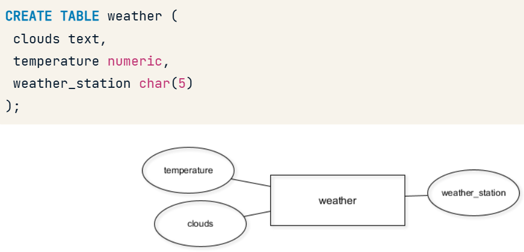
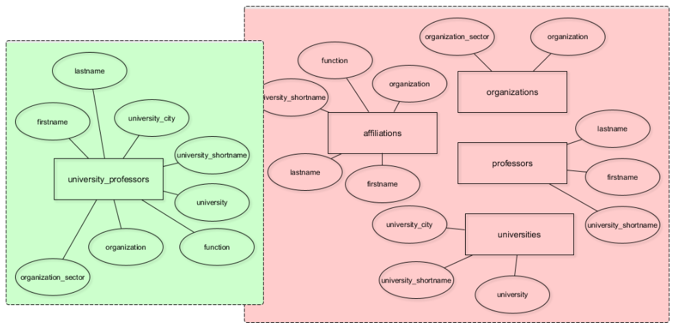
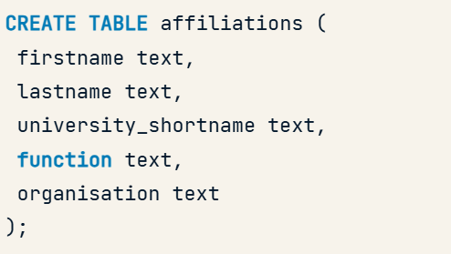

# Intro to Relational Databases in SQL

Let me tell you a little story first. As a data journalist, I try to uncover corruption, misconduct and other newsworthy stuff with data. A couple of years ago I researched secondary employment of Swiss university professors. It turns out a lot of them have more than one side job besides their university duty, being paid by big companies like banks and insurances. So I discovered more than 1500 external employments and visualized them in an interactive graphic, shown on the left. For this story, I had to compile data from various sources with varying quality. Also, I had to account for certain specialties, for example, that a professor can work for different universities; or that a third-party company can have multiple professors working for them. In order to analyze the data, I needed to make sure its quality was good and stayed good throughout the process. That's why I stored my data in a database, whose quite complex design you can see in the right graphic. All these rectangles were turned into database tables.

But why did I use a database?

Throughout this course, you will actually work with the same real-life data used during my investigation. You'll start from a single table of data and build a full-blown relational database from it, column by column, table by table.
By doing so, you'll get to know constraints, keys, and referential integrity. These three concepts help preserve data quality in databases.
By the end of the course, you'll know how to use them. In order to get going, you'll just need a basic understanding of SQL – which can also be used to build and maintain databases, not just for querying data.

## Create Table

At the minimum, this command requires a table name and one or more columns with their respective data types.
 The table name is the name of the table you want to create. The column names and data types are the names and data types of the columns you want to create in the table.

 

 For example, you could create a "weather" table with three aptly named columns. After each column name, you must specify the data type. There are many different types, and you will discover some in the remainder of this course. For example, you could specify a text column, a numeric column, and a column that requires fixed-length character strings with 5 characters each.

 

 Oops! We forgot to add the university_shortname column to the professors table.
 However, adding columns to existing tables is easy, especially if they're still empty.
 To add columns you can use the following SQL query:

 

 

 ## Migrate data between tables

 Here's the current entity-relationship diagram, showing the five tables.

 

 At this moment, only the "university_professors" table holds data. The other four, shown in red, are still empty.

 You will migrate data from the green part of this diagram to the red part, moving the respective entity types to their appropriate tables. In the end, you'll be able to delete the "university_professors" table.

 One advantage of splitting up "university_professors" into several tables is the reduced redundancy. As of now, "university_professors" holds 1377 entries. However, there are only 1287 distinct organizations. 
 Therefore, you only need to store 1287 distinct organizations in the new "organizations" table.

### INSERT DISTINCT records INTO the new tables
 In order to copy data from an existing table to a new one, you can use the "INSERT INTO SELECT DISTINCT" pattern.

 

After "INSERT INTO", you specify the name of the target table – "organizations" in this case. Then you select the columns that should be copied over from the source table – "unviversity_professors" in this case. You use the "DISTINCT" keyword to only copy over distinct organizations.

`If you just used "INSERT INTO SELECT", without the "DISTINCT" keyword, duplicate records would be copied over as well.`

### The INSERT INTO statement
This is the normal use case for "INSERT INTO" – where you insert values manually.

"INSERT INTO" is followed by the table name and an optional list of columns which should be filled with data. Then follows the "VALUES" keyword and the actual values you want to insert.

### RENAME a COLUMN

Unfortunately, I made a mistake in this process. Can you spot it? The way the "organisation" column is spelled is not consistent with the American-style spelling of this table, using an "s" instead of a "z".

You will correct this with the known "ALTER TABLE" syntax.
You do this with the RENAME COLUMN command by specifying the old column name first and then the new column name, i.e., "RENAME COLUMN old_name TO new_name".

### DROP a COLUMN

The syntax for this is again very simple, you use a "DROP COLUMN" command followed by the name of the column. Dropping columns is straightforward when the tables are still empty, so it's not too late to fix this error.

But why is it an error in the first place?

Well, I queried the "university_professors" table and saw that there are 551 unique combinations of first names, last names, and associated universities. I then queried the table again and only looked for unique combinations of first and last names. Turns out, this is also 551 records. This means that the columns "firstname" and "lastname" uniquely identify a professor.

So the "university_shortname" column is not needed in order to reference a professor in the affiliations table.

You can remove it, and this will reduce the redundancy in your database again. In other words: The columns "firstname", "lastname", "function", and "organization" are enough to store the affiliation a professor has with a certain organization.

### DROP a TABLE

You can also drop tables. This is done with the "DROP TABLE" command followed by the name of the table. This will delete the table and all of its contents from the database. This is a permanent action and cannot be undone.

