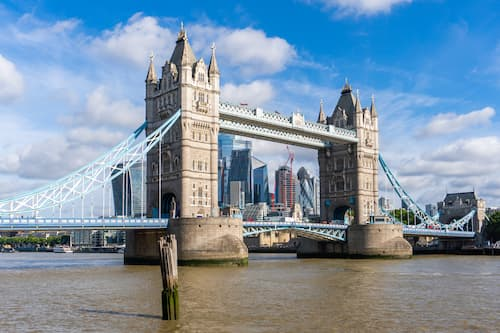
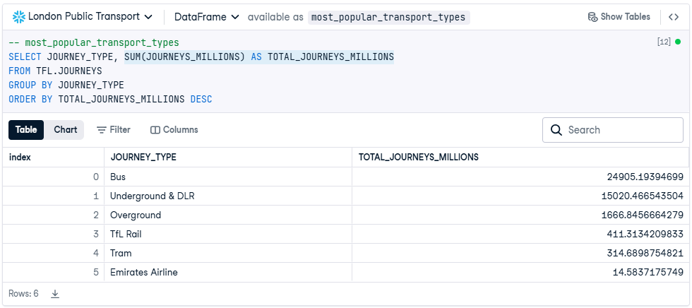

# Exploring London's Travel Network
London, or as the Romans called it "Londonium"! Home to over 8.5 million residents who speak over 300 languages. 
While the City of London is a little over one square mile (hence its nickname "The Square Mile"), Greater London has grown to encompass 32 boroughs spanning a total area of 606 square miles! 

Given the city's roads were originally designed for horse and cart, this area and population growth has required the development of an efficient public transport system! Since the year 2000, this has been through the local government body called Transport for London, or TfL, which is managed by the London Mayor's office. Their remit covers the London Underground, Overground, Docklands Light Railway (DLR), buses, trams, river services (clipper and Emirates Airline cable car), roads, and even taxis. 

In this project, you will work with a slightly modified version of a dataset containing information about public transport journey volume by transport type.

The data has been loaded into a Snowflake database called TFL with a single table called JOURNEYS, including the following data: 

## Exercise
Write three SQL queries to answer the following questions:

1. What are the most popular transport types, measured by the total number of journeys? The output should contain two columns, 1) JOURNEY_TYPE and 2) TOTAL_JOURNEYS_MILLIONS, and be sorted by the second column in descending order. Save the query as most_popular_transport_types.

2. Which five months and years were the most popular for the Emirates Airline? Return an output containing MONTH, YEAR, and JOURNEYS_MILLIONS, with the latter rounded to two decimal places and aliased as ROUNDED_JOURNEYS_MILLIONS. Exclude null values and save the result as emirates_airline_popularity.

3. Find the five years with the lowest volume of Underground & DLR journeys, saving as least_popular_years_tube. The results should contain the columns YEAR, JOURNEY_TYPE, and TOTAL_JOURNEYS_MILLIONS.

## Solution
1. 
2. 
3. 